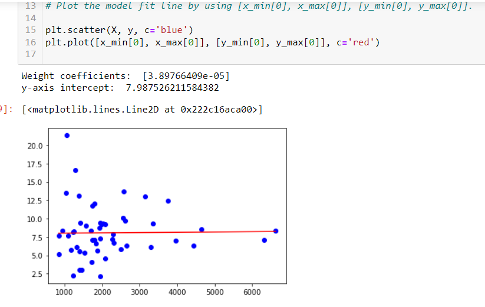
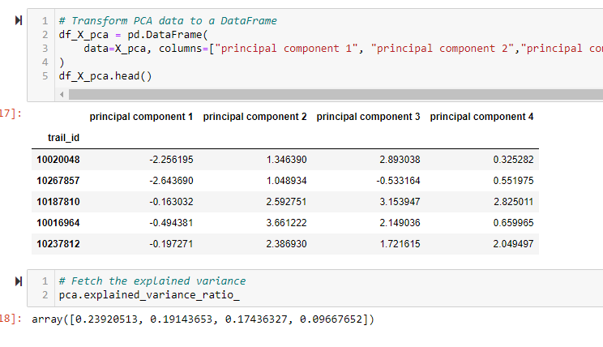

# Nat_Parks_Project

This machine learning program analyzes national park data on biodiversity and park trail popularity to suggest the best location for the next national park. Our project seeks to answer the following questions:

1. Does biodiversity have a correllation with park popularity?
2. What categories can we create to plan investment strategy? 
3. Where should the next park be built?

## Project Overview:

### Communication:
1. Slack channel with all members included
2. Email

### Data Sources:

1. [Biodiversity Dataset:](https://www.kaggle.com/datasets/nationalparkservice/park-biodiversity?select=parks.csv)

    a. parks.csv (56 values)

    b. species.csv (119248 values)

2. [Popularity Dataset:](https://www.kaggle.com/datasets/planejane/national-park-trails)

    a. AllTrails data - nationalpark.csv (3288 values)

### Google Slides PowerPoint

[Link to Google Slides](https://docs.google.com/presentation/d/1K_Hdr0zkWgMWZNgbmpIYqnqNQ8xBo2TaI6PAxGkzRgg/edit?usp=sharing)

### Database Structure: 

Below is an ERD describing the 3 tables we will use in this analysis:

After completing the ETL process on the parks, trail data, and biodiversity tables we chose to use, we imported them into PostgreS. From here we can run counts and merges in a more visually appealing environment outside of Pandas.

Below is the "trails" database as an example:

Using the "join" SQL code, we were able to make the first workable combined table we will then use for the linear regression analysis.

We did 3 key actions here:
* We **joined data from the 2 tables**
* Created a counted data column that **counted the number of trails** per park from the trails_db and **joined that count to parks_db**
* Created a counted data column that **counted the number of species** present per park from the bio_db and **joined that count to parks_db**

### Machine Learning Models: 

#### 1. Does biodiversity have a correllation with park popularity?

##### Machine Learning models: Linear regression
File: [ML_Linear_Model_Test](ML_Linear_Regression_Test.ipynb)

    a. Hypothesis: If trail popularity is based on biodiversity, then parks with over 20 species in the park have over a 60 popularity score.
    
    b. Null Hypothesis: There is no relationship between the biodiversity and popularity if parks of over 20 species are more often to be less than 60 popularity.

    c. Alternative Hypothesis: If trail popularity is not based on popularity, then parks will have less than 20 species will be above the mean in popularity.

    d. Accepted score: Accepted accuracy score of 0.70

##### Results: 
The linear regression model showed no correlation, proving the null hypothesis to be true: There is no relationship between the biodiversity and popularity of the park. The accuracy score of the linear regression is -0.017, which is significantly below the threshold we set of 0.70. In the scatter plot and linear regression below, the popularity data points are so dispersed that the line is mainly horizontal and not aligned with the shape of the scatter plot. 

##### Potential Next Steps: 
    a. Test linear regression or multiple linear regression on other data points to find the real driver of popularity.
    b. Use the Yelp API to get park popularity by park for better predictions.
    c. Use the Trails data set to test individual trail popularity with park biodiversity, or use multiple linear regression. 

#### 2. What categories can we create to plan investment strategy? 

##### Machine learning models: PCA and K-Means algorithms
File: [ml_models.ipynb](ml_models.ipynb)

##### Results:
We used 4 categories of principal components to extract features of the trails dataset for further classification:

Further K-Means analysis provided 4 main categories to direct trail investment:

Trail classes and investment recommendations: 
* Class 1: High popularity and biodiversity = Highest investment level
* Class 2: Medium-high popularity and biodiversity = 2nd highest investment level
* Class 3: Medium-low popularity and biodiversity = 3rd highest investment level
* Class 4: Low popularity and biodiversity = lowest investment level

#### 3. What trail features most affect average rating? 

##### Machine learning models: EasyEnsembleClassifier and RandomForest
File: [ml_models.ipynb](ml_models.ipynb)

Features: elevation gain, length, difficulty rating, feature availability, activity availability
Target Variable: average rating

##### Results: 
The resulting accuacy score for our Easy Ensemble Classifier model fit with the trail rating and feature data was low at 0.08. Using the feature importance technique of the Random Forest Classifier, we identified 15 fields which affected the data above 0.02, and used only these fields to rerun the models. 

The second run with only 15 of the trails fields resulted in an accuracy score of 0.11. This low score further supports our findings that the popularity and rating data is very subjective and depends on individual preferences. However, we used the feature importance of the random forest model to find that the most significant fields for predicting average rating were trail eleveation gain and length.  

##### Potential Next Steps: 
    a. Re-run this analysis using Popularity as a predictor 
    b. Re-run this analysis using Rating as a predictor

### Tableau Dashboard

[Link to Tableau Dashboard](https://public.tableau.com/app/profile/brittney.r.stanley/viz/Parks_Presentation_16598841285810/Storyboard?publish=yes)

#### Outline of Final Tableau Storyboard:
* Use the irrelevance of popularity to highlight in a chart - somehow a chart with 2 features. (parks_pop_bio.csv)
* Circle map colored to represent categories for investment levels
* Dashboard of Charts:
    * Ranked by popularity
    * Ranked by biodiversity
    * Ranked by hiking difficulty_rating
    * Ranked by Number of trails
* Top 15 parks to visit!
* Maps that play with elevation and plot some trails - map to rating data

#### Tools to be Used
1. Tableau Worksheets to create visuals

2. Tableau Dashboard to present created visuals with details

3. Saved to Tableau Public and shared as a link for interactive dashboard

#### Interactive Tools
1. Interactive map is created to show the most popular parks and their locations with information on trail count, acres, and park name when hovering over data point on map.

2. Interactive bar chart to display the top 15 Parks to visit based on average popularity, trail count is shown with shading, number of acres are shown outside of the bar. More information is given when hovering over bar on the graph.

### Project Limitations

1. We used biodiversity data per park, and popularity data per trail.

We attempted averaging the popularity data by park, which standardized it for the linear regression, but effectively changed the data. In reality, popularity of park is very subjective. 

2. Unable to answer original question "What state should we build the next park?". 

In order to answer this we would have to have values for if a state is desireable or undesireable - which we could assign using criteria in the original dataset, and it does not need machine learning.

3. Popularity and Rating are very subjective and difficult to make predictions based on this. 

### Question ideas:

Does the popularity of a park negatively affect biodiversity (i.e. more species with a conservation status/ higher conservation status number)

What we do know:
- popularity score is generated by rating, number of ratings
- popular trails are not necessarily biodiverse (to protect the environment)

What trail features best indicate park rating? 
- length? 
- elev gain?
- features? out-back, or loop? 
- route type

